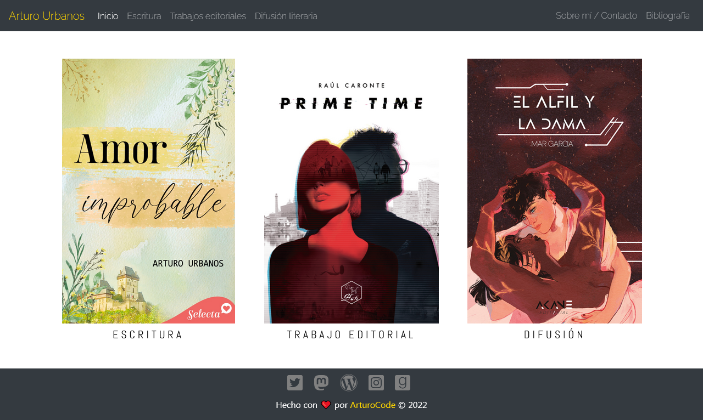
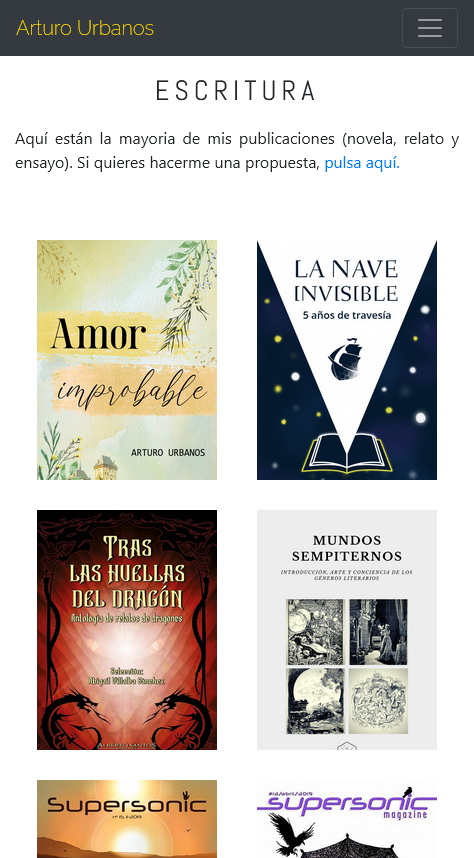

# Portfolio | Arturo Urbanos

Una página web con distintas secciones para servir de portfolio a un escritor o creador de contenido literario.

Es una página realizada con HTML, CSS, JavaScript, JQuery y Bootstrap, principalmente, y es responsive.

<table>
    <tr>
        <td></td>
        <td></td>
    </tr>
</table>